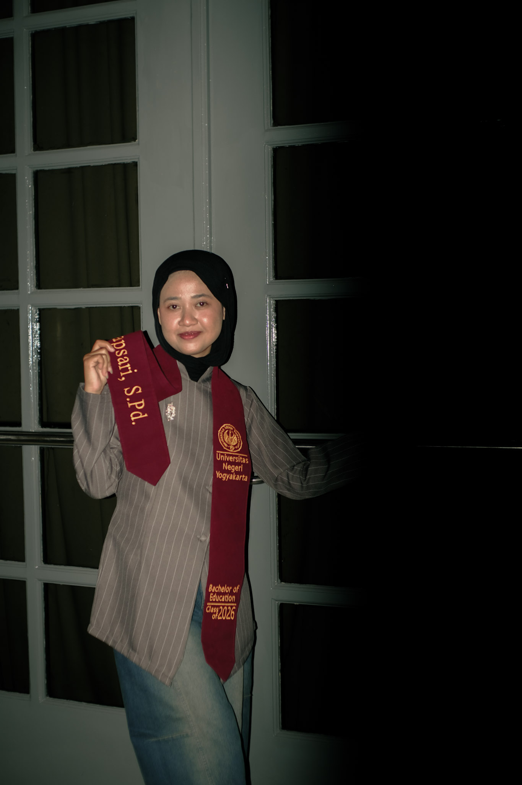

---
project:
  type: website

website:
  title: "Nida Salma"
  navbar:
    background: "#2F6F5E"
    foreground: white
    left:
      - href: index.qmd
        text: Home
      - href: about.qmd
        text: About Me
      - href: research.qmd
        text: Research
      - href: projects.qmd
        text: Projects

format:
  html:
    theme: cosmo
    css: styles.css
    toc: false
---

---
title: ""
---

:::::: hero-section
:::: hero-text
<h1>Hi, I'm Nida Salma 👋</h1>

<h2>Bachelor's Degree of Sociology Education \| Research \| Data Analysis</h2>

I am passionate about education, social research, and data analysis. I enjoy exploring social issues through research and transforming data into meaningful insights.

::: hero-buttons
<a href="projects.qmd" class="btn-primary">View My Projects</a>

<a href="about.qmd" class="btn-secondary">About Me</a>
:::
::::

::: hero-image

:::
::::::

------------------------------------------------------------------------

## Featured Projects

:::::: grid
::: g-col-4
### 📊 World Values Survey

**Education & Religiosity**

Research examining the relationship between educational attainment and religiosity using WVS Indonesia data.
:::

::: g-col-4
### 📈 PISA

**Educational Data Analysis**

Analysis of student experiences, school environment, and educational outcomes.
:::

::: g-col-4
### 📚 Asesmen Nasional

**Indonesian Educational Data**

Exploring student learning outcomes and constructive feedback using national assessment data.
:::
::::::

------------------------------------------------------------------------

## My Educational

**Universitas Negeri Yogyakarta**

*Bachelor of Sociology Education*

I am a Sociology of Education graduate with experience in research, teaching, organizational work, and data analysis.

My academic interests include:

- Sociology of Education
- Educational inequality
- Religiosity and education
- Quantitative research
- Social research
- Data analysis

------------------------------------------------------------------------

## What I Do

:::::: columns
::: {.column width="33%"}
### 🔎 Research

Research experience from high school to university, including quantitative social research.
:::

::: {.column width="33%"}
### 📊 Data Analysis

Working with R, data cleaning, visualization, descriptive statistics, and regression analysis.
:::

::: {.column width="33%"}
### 🎓 Education

Experience in teaching Sociology and educational research.
:::
::::::

---
title: "Projects"
---

## Research Projects

### Does Education Affect Religiosity?

**Research Project — World Values Survey Indonesia**

This research examines the relationship between educational attainment and religiosity using World Values Survey Indonesia data.

**Methods**

- Data cleaning
- Descriptive statistics
- Regression analysis
- Data visualization
- R programming

**Tools:** R, RStudio, ggplot2, dplyr, flextable

------------------------------------------------------------------------

### PISA Data Analysis

**Educational Research Project**

Analysis of PISA data to explore relationships between student experiences, school environment, and educational outcomes.

**Methods**

- Data preparation
- Exploratory data analysis
- Data visualization
- Regression analysis
- Multilevel analysis

**Tools:** R, tidyverse, ggplot2

------------------------------------------------------------------------

### Asesmen Nasional 2025

**Educational Data Analysis**

Analysis of Indonesian Asesmen Nasional data focusing on student learning outcomes and constructive feedback.

**Tools:** R, tidyverse, data.table

## Skills

| Category      | Skills                               |
|---------------|--------------------------------------|
| Data Analysis | R, RStudio, tidyverse                |
| Visualization | ggplot2                              |
| Statistics    | Descriptive Statistics, Regression   |
| Research      | Quantitative Research, Data Cleaning |
| Education     | Sociology Teaching                   |

## My Experience

### *Research Intern*

- Coordinated with senior researchers to design research methodologies, ensuring adherence to project objectives.
- Reviewed academic literature to identify research gaps, guiding the direction of future studies.
- Conducted comprehensive literature reviews to support ongoing research projects, enhancing the depth of studies.

### *Research Data Analysis*

Prepared and analyzed secondary data for research in social sciences to understand the religiosity movement in a country.

### *Assistant Lecturer*

- Kept records of student attendance, progress, and activities to assess individual mastery of subject matter.
- Monitored student progress through regular assessments, providing feedback to lead teachers for targeted support.
- Provided one-to-one support to students requiring additional help.

### *Teaching Intern*

Experience teaching Sociology at the high-school level.

## Organization

Experience in secretariat, documentation, proposal preparation, and organizational administration.

**Dewan Perwakilan Mahasiswa**

Melakukan pengawasan dan controlling terhadap Ormawa Fakultas yang ada, serta berhubungan dengan kesekretariatan Dekanat, seperti berurusan dengan Laporan dan Proposal kegiatan para Ormawa.

**Mediasi (Media Aspirasi Mahasiswa Sosiologi)**

Menjadi bagian dari Tim Reporter yang bertugas dalam melakukan wawancara terhadap narasumber, serta melaporkan transkrip hasil wawancara.

---
title: "Get To Know Me"
---

## My Contact Person

*Thank you for seeing my portfolio*

📧 **Email:** nidasalmahapsari01\@gmail.com

💼 **LinkedIn:** [Linkedin](https:/www.linkedin.com/in/nida-salma26)

☎️**Phone Number:** 085967174765
